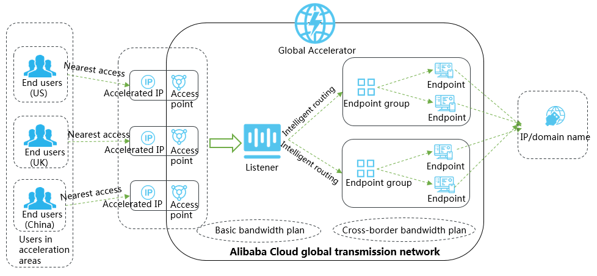
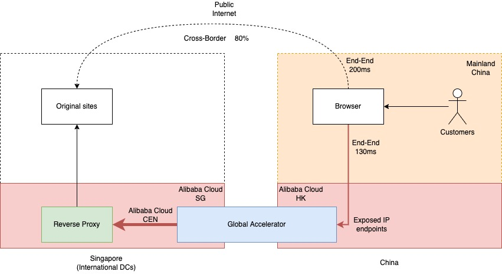
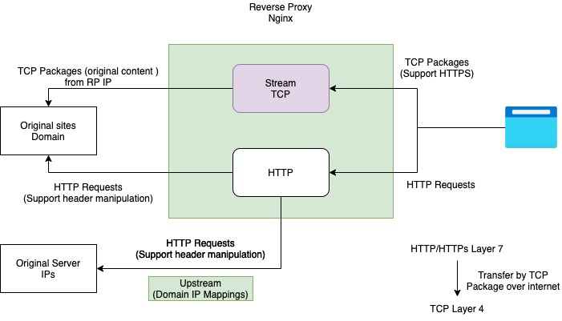

<p align="center">
<a href=" https://www.alibabacloud.com"></a>
</p>

The Alibaba Cloud Terraform modules for a Global Accelerator (GA) PoC. 


# Requirements
+ To use Alibaba Cloud Terraform modules for PoC, you must have an Alibaba Cloud account with an `AccessKey ID` and `AccessKey Secret`.

# Installation
+ Install terraform cli and terragrunt cli(optional).
+ Init project and refer modules.

## Terraform
Terraform is an open-source infrastructure as code software tool that provides a consistent CLI workflow to manage hundreds of cloud services. 
Terraform codifies cloud APIs into declarative configuration files.

To install terraform in your machine, please refer to [Terraform Download](https://www.terraform.io/downloads)

## Terragrunt
Terragrunt is a thin wrapper that provides extra tools for keeping your configurations DRY, working with multiple Terraform modules, and managing remote state.

To install `Terragrunt` in your machine, please refer to [Terragrunt Install](https://terragrunt.gruntwork.io/docs/getting-started/install/)

# Module Usage
You can refer to this project by module. 
If you use `Terragrunt`, you can add following code to a `terragrunt.hcl`.
```hcl
terraform {
    source = "git::https://github.com/zchome/alicloud-ga-reverse-proxy.git//modules/ga"
}

inputs = {
    name                    = "ga"
    endpoint_ip_address     = "192.x.x.x"
    accelerate_region_id    = "cn-hongkong"
    endpoint_group_region   = "eu-central-1"
}
```

# Example Usage(Terragrunt)
+ Export `ALICLOUD_ACCESS_KEY` `ALICLOUD_SECRET_KEY` `ALICLOUD_REGION` variables to env.
+ Include required modules as your requirement.
+ Execute `terragrunt run-all init` & `terragrunt run-all apply` to apply resources on the parent directory in given region.

## How it works
Global Accelerator is a network acceleration service, benefiting from the high-quality bandwidth and global transmission networks that are provided by Alibaba Cloud. 
Global Accelerator enables nearby access to the Internet and cross-region deployment of applications, improving the user experience of Internet services. 
Global Accelerator features high network quality, high security, high availability, and low latency. 
In addition, Global Accelerator can be activated within several minutes, making service deployment more agile.
Refer to [Alibaba GA](https://www.alibabacloud.com/help/en/doc-detail/153189.html).



For PoC, an reverse proxy is added. The reverse proxy is used to filter traffic and restrict domains.



## Additional Configuration
Update `nginx` config as a reverse proxy.




### HTTP/HTTPS reverse proxy mode
Add a config file `sample.conf` to directory `/etc/nginx/default`

HTTP reverse proxy
```
server {
    listen       80 default_server;
    listen  [::]:80 default_server;
    server_name a.sample.domain;

    include /etc/nginx/default.d/*.conf;

    location / {
        proxy_set_header Host $host;
        proxy_set_header Accept-Encoding "";
        proxy_set_header X-Real-IP $remote_addr;
        proxy_set_header X-Forwarded-For $proxy_add_x_forwarded_for;
        proxy_set_header Cookie $http_cookie;

        proxy_pass       http://xxx.xxx.xxx.xxx:$server_port$request_uri;
        resolver         8.8.8.8;
    }
}
```

HTTP reverse proxy
```
server {
    listen       443 ssl;
    listen  [::]:443 ssl;
    server_name a.sample.domain;

    include /etc/nginx/default.d/*.conf;

    ssl_certificate           /etc/nginx/server.pem;
    ssl_certificate_key       /etc/nginx/server.key;
    ssl_protocols             TLSv1 TLSv1.1 TLSv1.2;
    ssl_ciphers               HIGH:!aNULL:!MD5;
    ssl_session_cache         shared:SSL:10m;
    ssl_session_timeout       10m;

    location / {

        proxy_set_header              Host $host;
        proxy_set_header              Accept-Encoding "";
        proxy_set_header              X-Real-IP $remote_addr;
        proxy_set_header              X-Forwarded-For $proxy_add_x_forwarded_for;
        proxy_set_header              Cookie $http_cookie;

        # proxy_ssl_certificate         /etc/nginx/server.pem;
        # proxy_ssl_certificate_key     /etc/nginx/server.key;
        # proxy_ssl_protocols           TLSv1 TLSv1.1 TLSv1.2;
        # proxy_ssl_ciphers             HIGH:!aNULL:!MD5;
        # # proxy_ssl_trusted_certificate /etc/nginx/trusted_ca_cert.crt;
        # proxy_ssl_verify              off;
        # proxy_ssl_session_reuse       on;

        proxy_pass                    http://xxx.xxx.xxx.xxx$request_uri;
        resolver                      8.8.8.8;
    }
}
```

### TCP stream mode proxy
Modify `nginx` configuration file `/etc/nginx/nginx.conf`
```
# Precondition intall steam module
# yum install nginx-mod-stream
user nginx;
worker_processes auto;
error_log /var/log/nginx/error.log;
pid /run/nginx.pid;

include /usr/share/nginx/modules/*.conf;

events {

  use epoll;
  worker_connections 4096;
}

# Setup https protocol strem forward
stream {

  map $ssl_preread_server_name $backend_pool {

    # Explicitly configure allowed domain names
    ~.*\.sample\.domain\.com $ssl_preread_server_name:$server_port;

    default "";
  }

  server {

    listen 443;
    ssl_preread on;
    resolver 8.8.8.8;
    proxy_pass $ssl_preread_server_name:$server_port;
  }
}
```